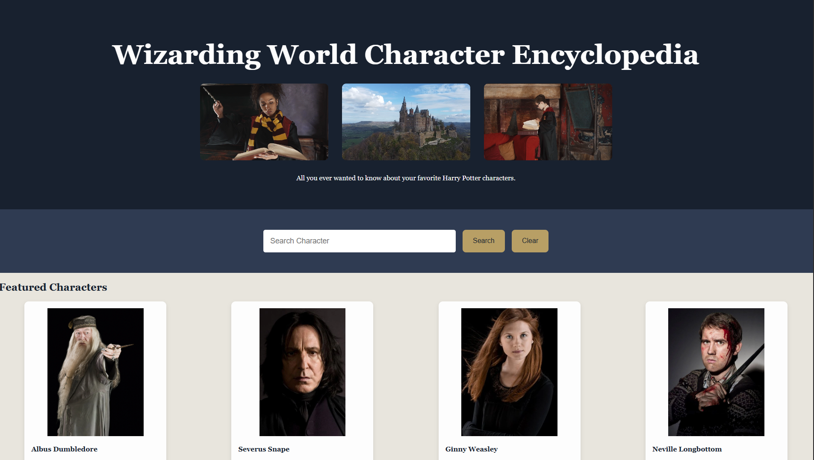

# Wizarding World Character Encyclopedia

## Description
Wizarding World Character Encyclopedia is a responsive front-end web application that allows users to search for Harry Potter characters using the PotterDB API. Users can browse featured characters, search the Wizarding World by name, and view information such as house, species, nationality, brith date, and links to additional information.

## Screenshot

## Features
- Search Wizarding World characters by name
- Displays multiple search results
- Shows character images when available
- Displays house, species, nationality, and birth information
- Includes links to each character's Potter Wiki page
- Responsive layout for desktop and mobile devices
- Featured character section on the homepage
- Clear search functionality

## Technologies Used
- HTML5
- CSS3
- JavaScript (ES6)
- PotterDB API
- Git
- GitHub
- GitHub Pages
## Website link 
(https://robinmatos7-cmd.github.io/harry-potter-encyclopedia/)